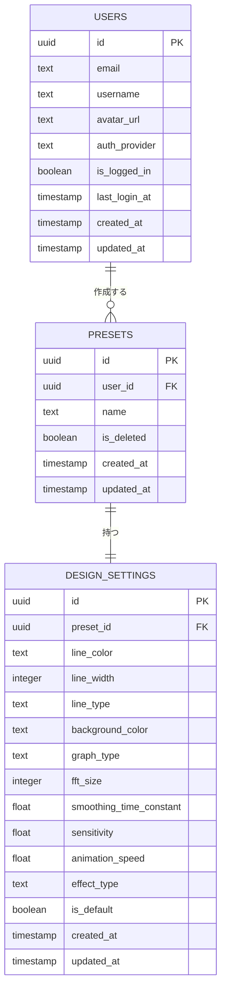

# ER図

対象: Webオーディオビジュアライザー

## リレーション

| リレーション | 多重度 | 説明 |
|---|---|---|
| USERS → PRESETS | 1 対 N | 1ユーザーは複数のプリセットを作成できる |
| PRESETS → DESIGN_SETTINGS | 1 対 1 | 1プリセットは1つのデザイン設定を持つ(`design_settings.preset_id`にUNIQUE制約) |

## 補足

- `USERS.id`はSupabase Auth(`auth.users.id`)と同一のUUIDを使用し、Google OAuth認証で連携する。
- `PRESETS`はユーザーとの紐づけ・命名のみを担い、デザイン内容の実体は`DESIGN_SETTINGS`のみが保持する(重複データを持たない)。
- 音声ファイル・再生位置・再生ステータスなどはブラウザ上のWeb Audio APIで処理し、DBには永続化しないためER図には含まれない。