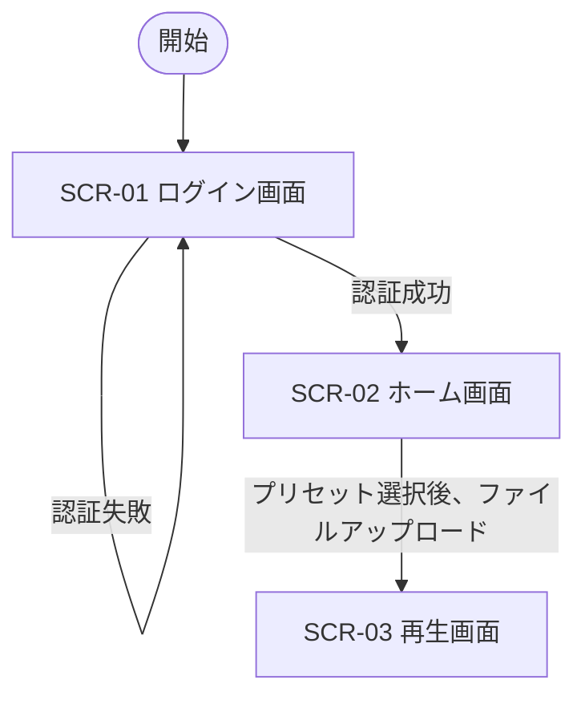

# 画面遷移図

## 画面一覧

| 画面ID | 画面名 | 概要 |
|---|---|---|
| SCR-01 | ログイン画面 | ユーザ認証を行う |
| SCR-02 | ホーム画面 | プリセットの選択・管理(編集・追加・削除・表示)、音声ファイルのアップロード |
| SCR-03 | 再生画面 | アップロードした音声ファイルを再生 |

## 遷移条件

- **SCR-01 → SCR-01**: 認証失敗時、ログイン画面にとどまる
- **SCR-01 → SCR-02**: 認証成功時、ホーム画面へ遷移
- **SCR-02 → SCR-03**: プリセットを選択し、ファイルをアップロードした後、再生画面へ遷移