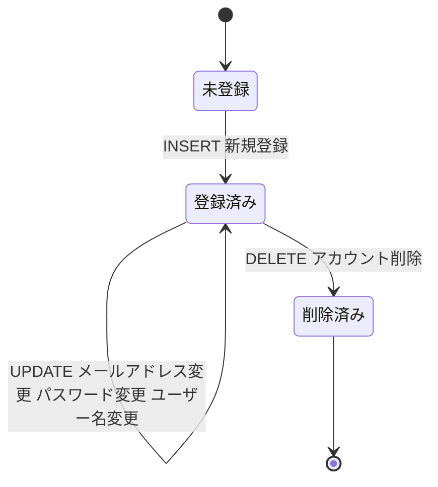
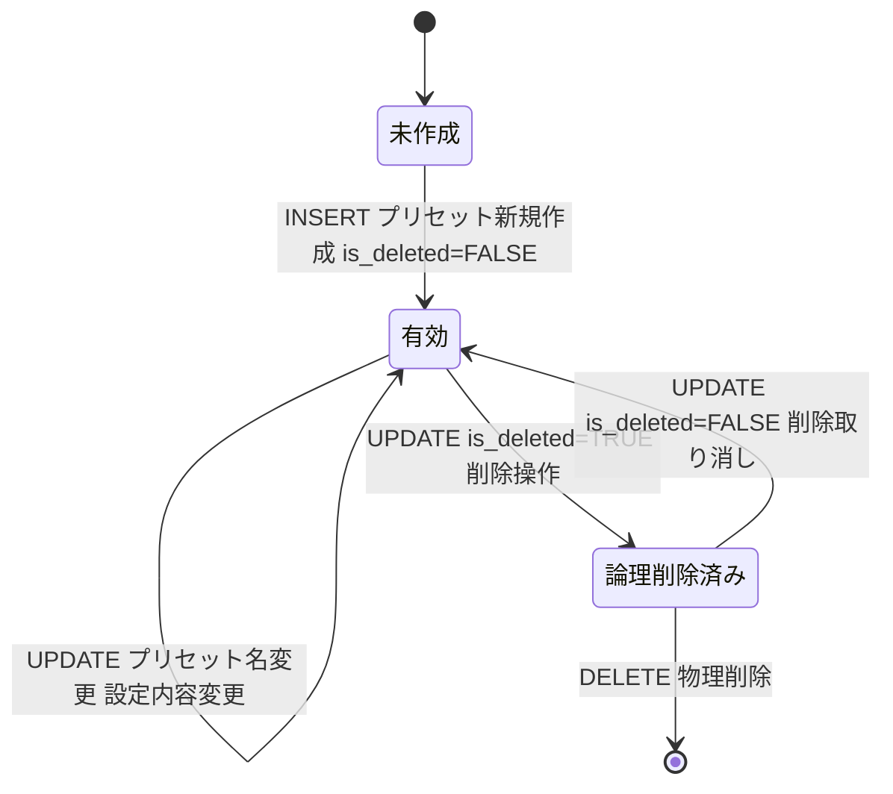
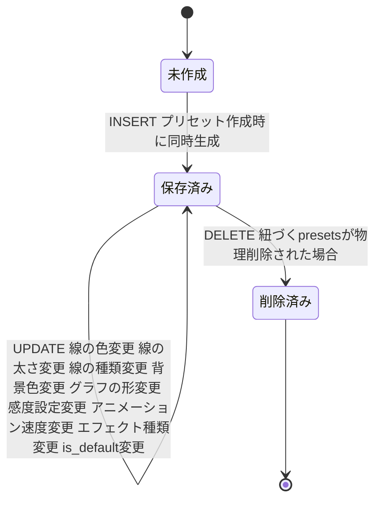
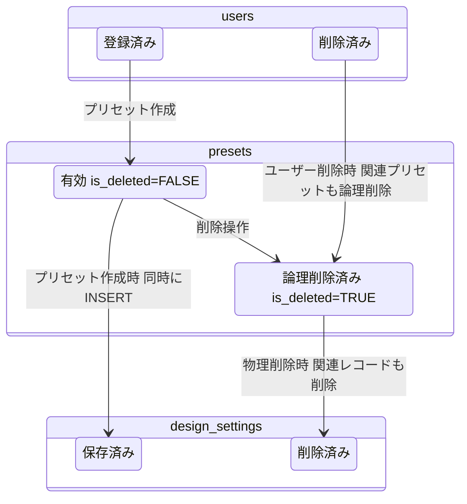

# DB状態遷移図 - Webオーディオビジュアライザー

## 1. usersテーブル

```mermaid
stateDiagram-v2
    [*] --> 未登録

    未登録 --> 登録済み : INSERT 新規登録
    登録済み --> 登録済み : UPDATE メールアドレス変更 パスワード変更 ユーザー名変更
    登録済み --> 削除済み : DELETE アカウント削除

    削除済み --> [*]
```

---

## 2. presetsテーブル

```mermaid
stateDiagram-v2
    [*] --> 未作成

    未作成 --> 有効 : INSERT プリセット新規作成 is_deleted=FALSE

    有効 --> 有効 : UPDATE プリセット名変更 設定内容変更
    有効 --> 論理削除済み : UPDATE is_deleted=TRUE 削除操作

    論理削除済み --> 有効 : UPDATE is_deleted=FALSE 削除取り消し
    論理削除済み --> [*] : DELETE 物理削除
```

---

## 3. design_settingsテーブル

```mermaid
stateDiagram-v2
    [*] --> 未作成

    未作成 --> 保存済み : INSERT プリセット作成時に同時生成

    保存済み --> 保存済み : UPDATE 線の色変更 線の太さ変更 線の種類変更 背景色変更 グラフの形変更 感度設定変更 アニメーション速度変更 エフェクト種類変更 is_default変更

    保存済み --> 削除済み : DELETE 紐づくpresetsが物理削除された場合

    削除済み --> [*]
```

---

## 4. テーブル間の状態連携

```mermaid
stateDiagram-v2
    state users {
        u1 : 登録済み
        u2 : 削除済み
    }

    state presets {
        p1 : 有効 is_deleted=FALSE
        p2 : 論理削除済み is_deleted=TRUE
    }

    state design_settings {
        d1 : 保存済み
        d2 : 削除済み
    }

    u1 --> p1 : プリセット作成
    p1 --> d1 : プリセット作成時 同時にINSERT
    p1 --> p2 : 削除操作
    u2 --> p2 : ユーザー削除時 関連プリセットも論理削除
    p2 --> d2 : 物理削除時 関連レコードも削除
```