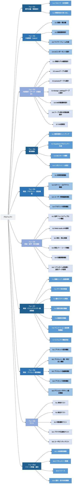

# WBS（Work Breakdown Structure）— Webオーディオビジュアライザー開発

```mermaid
flowchart LR
    ROOT["プロジェクト"]

    %% ===== フェーズ1 =====
    ROOT --> P1["フェーズ1<br/>要件定義・情報設計"]
    P1 --> T11["1.1 ペルソナ・目的整理"]
    P1 --> T12["1.2 情報項目の洗い出し"]

    %% ===== フェーズ2 =====
    ROOT --> P2["フェーズ2<br/>外部設計（UI/UX）"]
    P2 --> T21["2.1 画面一覧定義"]
    P2 --> T22["2.2 画面遷移設計"]
    P2 --> T23["2.3 ワイヤーフレーム作成"]
    P2 --> T24["2.4 UIコンポーネント設計"]

    %% ===== フェーズ3 =====
    ROOT --> P3["フェーズ3<br/>内部設計（データ・状態設計）"]
    P3 --> T31["3.1 情報モデル概要設計"]
    P3 --> T32["3.2 usersテーブル設計"]
    P3 --> T33["3.3 presetsテーブル設計"]
    P3 --> T34["3.4 design_settingsテーブル設計"]
    P3 --> T36["3.5 DB状態遷移設計"]
    P3 --> T37["3.6 テーブル間の状態連携設計"]
    P3 --> T38["3.7 ER図確定"]

    %% ===== フェーズ4 =====
    ROOT --> P4["フェーズ4<br/>環境構築"]
    P4 --> T41["4.1 開発環境セットアップ"]
    P4 --> T42["4.2 Supabaseプロジェクト作成"]
    P4 --> T43["4.3 DBスキーマ構築"]
    P4 --> T44["4.4 リポジトリ・CI設定"]

    %% ===== フェーズ5 =====
    ROOT --> P5["フェーズ5<br/>実装：アカウント・認証機能"]
    P5 --> T51["5.1 新規登録機能"]
    P5 --> T52["5.2 ログイン・ログアウト機能"]
    P5 --> T53["5.3 ユーザー情報編集機能"]
    P5 --> T54["5.4 アカウント削除機能"]

    %% ===== フェーズ6 =====
    ROOT --> P6["フェーズ6<br/>実装：音声・再生機能"]
    P6 --> T61["6.1 音声ファイルアップロード機能"]
    P6 --> T62["6.2 Web Audio API連携"]
    P6 --> T63["6.3 再生・停止制御"]
    P6 --> T64["6.4 再生バー・シーク機能"]
    P6 --> T65["6.5 音量調整機能"]
    P6 --> T66["6.6 リアルタイム周波数・波形データ取得"]

    %% ===== フェーズ7 =====
    ROOT --> P7["フェーズ7<br/>実装：ビジュアライザー描画機能"]
    P7 --> T71["7.1 描画エンジン基盤構築"]
    P7 --> T72["7.2 グラフ形状実装"]
    P7 --> T73["7.3 線のスタイル実装"]
    P7 --> T74["7.4 背景色設定機能"]
    P7 --> T75["7.5 感度設定機能"]
    P7 --> T76["7.6 アニメーション速度調整機能"]
    P7 --> T77["7.7 エフェクト機能実装"]

    %% ===== フェーズ8 =====
    ROOT --> P8["フェーズ8<br/>実装：プリセット管理機能"]
    P8 --> T81["8.1 プリセット保存機能"]
    P8 --> T82["8.2 プリセット一覧・呼び出し機能"]
    P8 --> T83["8.3 プリセット名編集機能"]
    P8 --> T84["8.4 プリセット削除機能"]
    P8 --> T85["8.5 デフォルトデザイン設定機能"]

    %% ===== フェーズ9 =====
    ROOT --> P9["フェーズ9<br/>テスト"]
    P9 --> T91["9.1 単体テスト"]
    P9 --> T92["9.2 結合テスト"]
    P9 --> T93["9.3 状態遷移テスト"]
    P9 --> T94["9.4 ブラウザ互換性テスト"]
    P9 --> T95["9.5 ユーザビリティテスト"]

    %% ===== フェーズ10 =====
    ROOT --> P10["フェーズ10<br/>リリース準備・運用"]
    P10 --> T101["10.1 本番環境構築"]
    P10 --> T102["10.2 ドキュメント整備"]
    P10 --> T103["10.3 リリース"]
    P10 --> T104["10.4 運用・保守体制構築"]

    %% ===== スタイル定義（3色を循環） =====
    classDef root fill:#eef1f4,stroke:#c9ced4,color:#333,font-weight:bold
    classDef phaseDark fill:#1f6091,stroke:#14425f,color:#fff,font-weight:bold
    classDef phaseMid fill:#2e75b6,stroke:#1f4e79,color:#fff,font-weight:bold
    classDef phaseLight fill:#8faadc,stroke:#5b7fb5,color:#fff,font-weight:bold
    classDef taskDark fill:#5b9bd5,stroke:#2f6a95,color:#fff
    classDef taskMid fill:#9dc3e6,stroke:#5b9bd5,color:#000
    classDef taskLight fill:#d9e2f3,stroke:#8faadc,color:#000

    class ROOT root

    class P1,P4,P7,P10 phaseDark
    class P2,P5,P8 phaseMid
    class P3,P6,P9 phaseLight

    class T11,T12,T13,T14 taskDark
    class T41,T42,T43,T44 taskDark
    class T71,T72,T73,T74,T75,T76,T77 taskDark
    class T101,T102,T103,T104 taskDark

    class T21,T22,T23,T24 taskMid
    class T51,T52,T53,T54 taskMid
    class T81,T82,T83,T84,T85 taskMid

    class T31,T32,T33,T34,T35,T36,T37,T38 taskLight
    class T61,T62,T63,T64,T65,T66 taskLight
    class T91,T92,T93,T94,T95 taskLight
```